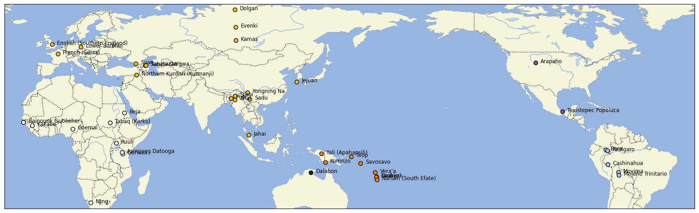

# CLDF dataset derived from the DoReCo core corpus

## How to cite

If you use these data please cite
- the original source
  > Seifart, Frank, Ludger Paschen & Matthew Stave (eds.). 2022. Language Documentation Reference Corpus (DoReCo) 1.2. Berlin & Lyon: Leibniz-Zentrum Allgemeine Sprachwissenschaft & laboratoire Dynamique Du Langage (UMR5596, CNRS & Université Lyon 2). DOI:10.34847/nkl.7cbfq779
- the derived dataset using the DOI of the [particular released version](../../releases/) you were using

Please note that when citing this dataset, it is NOT sufficient to refer to DoReCo as a whole, but the full citation for each individual corpus must be provided, including the name(s) of the creator(s) of each corpus as given below.
> Ozerov, Pavel. 2022. Anal DoReCo dataset. In Seifart, Frank, Ludger Paschen and Matthew Stave (eds.). Language Documentation Reference Corpus (DoReCo) 1.2. Berlin & Lyon: Leibniz-Zentrum Allgemeine Sprachwissenschaft & laboratoire Dynamique Du Langage (UMR5596, CNRS & Université Lyon 2). https://doreco.huma-num.fr/languages/anal1239. DOI:10.34847/nkl.0dbazp8m

> Riesberg, Sonja. 2022. Yali (Apahapsili) DoReCo dataset. In Seifart, Frank, Ludger Paschen and Matthew Stave (eds.). Language Documentation Reference Corpus (DoReCo) 1.2. Berlin & Lyon: Leibniz-Zentrum Allgemeine Sprachwissenschaft & laboratoire Dynamique Du Langage (UMR5596, CNRS & Université Lyon 2). https://doreco.huma-num.fr/languages/apah1238. DOI:10.34847/nkl.9d91nkq2

> Cowell, Andrew. 2022. Arapaho DoReCo dataset. In Seifart, Frank, Ludger Paschen and Matthew Stave (eds.). Language Documentation Reference Corpus (DoReCo) 1.2. Berlin & Lyon: Leibniz-Zentrum Allgemeine Sprachwissenschaft & laboratoire Dynamique Du Langage (UMR5596, CNRS & Université Lyon 2). https://doreco.huma-num.fr/languages/arap1274. DOI:10.34847/nkl.36f5r1b6

> Cobbinah, Alexander Yao. 2022. Baïnounk Gubëeher DoReCo dataset. In Seifart, Frank, Ludger Paschen and Matthew Stave (eds.). Language Documentation Reference Corpus (DoReCo) 1.2. Berlin & Lyon: Leibniz-Zentrum Allgemeine Sprachwissenschaft & laboratoire Dynamique Du Langage (UMR5596, CNRS & Université Lyon 2). https://doreco.huma-num.fr/languages/bain1259. DOI:10.34847/nkl.a332abw8

> Vanhove, Martine. 2022. Beja DoReCo dataset. In Seifart, Frank, Ludger Paschen and Matthew Stave (eds.). Language Documentation Reference Corpus (DoReCo) 1.2. Berlin & Lyon: Leibniz-Zentrum Allgemeine Sprachwissenschaft & laboratoire Dynamique Du Langage (UMR5596, CNRS & Université Lyon 2). https://doreco.huma-num.fr/languages/beja1238. DOI:10.34847/nkl.edd011t1

> Seifart, Frank. 2022. Bora DoReCo dataset. In Seifart, Frank, Ludger Paschen and Matthew Stave (eds.). Language Documentation Reference Corpus (DoReCo) 1.2. Berlin & Lyon: Leibniz-Zentrum Allgemeine Sprachwissenschaft & laboratoire Dynamique Du Langage (UMR5596, CNRS & Université Lyon 2). https://doreco.huma-num.fr/languages/bora1263. DOI:10.34847/nkl.6eaf5laq

> Reiter, Sabine. 2022. Cashinahua DoReCo dataset. In Seifart, Frank, Ludger Paschen and Matthew Stave (eds.). Language Documentation Reference Corpus (DoReCo) 1.2. Berlin & Lyon: Leibniz-Zentrum Allgemeine Sprachwissenschaft & laboratoire Dynamique Du Langage (UMR5596, CNRS & Université Lyon 2). https://doreco.huma-num.fr/languages/cash1254. DOI:10.34847/nkl.a8f9q2f1

> Däbritz, Chris Lasse and Kudryakova, Nina and Stapert, Eugénie and Arkhipov, Alexandre. 2022. Dolgan DoReCo dataset. In Seifart, Frank, Ludger Paschen and Matthew Stave (eds.). Language Documentation Reference Corpus (DoReCo) 1.2. Berlin & Lyon: Leibniz-Zentrum Allgemeine Sprachwissenschaft & laboratoire Dynamique Du Langage (UMR5596, CNRS & Université Lyon 2). https://doreco.huma-num.fr/languages/dolg1241. DOI:10.34847/nkl.f09eikq3

> Kazakevich, Olga and Klyachko, Elena. 2022. Evenki DoReCo dataset. In Seifart, Frank, Ludger Paschen and Matthew Stave (eds.). Language Documentation Reference Corpus (DoReCo) 1.2. Berlin & Lyon: Leibniz-Zentrum Allgemeine Sprachwissenschaft & laboratoire Dynamique Du Langage (UMR5596, CNRS & Université Lyon 2). https://doreco.huma-num.fr/languages/even1259. DOI:10.34847/nkl.5e0d27cu

> Hellwig, Birgit. 2022. Goemai DoReCo dataset. In Seifart, Frank, Ludger Paschen and Matthew Stave (eds.). Language Documentation Reference Corpus (DoReCo) 1.2. Berlin & Lyon: Leibniz-Zentrum Allgemeine Sprachwissenschaft & laboratoire Dynamique Du Langage (UMR5596, CNRS & Université Lyon 2). https://doreco.huma-num.fr/languages/goem1240. DOI:10.34847/nkl.b93664ml

> Harvey, Andrew. 2022. Gorwaa DoReCo dataset. In Seifart, Frank, Ludger Paschen and Matthew Stave (eds.). Language Documentation Reference Corpus (DoReCo) 1.2. Berlin & Lyon: Leibniz-Zentrum Allgemeine Sprachwissenschaft & laboratoire Dynamique Du Langage (UMR5596, CNRS & Université Lyon 2). https://doreco.huma-num.fr/languages/goro1270. DOI:10.34847/nkl.a4b4ijj2

> Burenhult, Niclas. 2022. Jahai DoReCo dataset. In Seifart, Frank, Ludger Paschen and Matthew Stave (eds.). Language Documentation Reference Corpus (DoReCo) 1.2. Berlin & Lyon: Leibniz-Zentrum Allgemeine Sprachwissenschaft & laboratoire Dynamique Du Langage (UMR5596, CNRS & Université Lyon 2). https://doreco.huma-num.fr/languages/jeha1242. DOI:10.34847/nkl.6a71xp0p

> Kim, Soung-U. 2022. Jejuan DoReCo dataset. In Seifart, Frank, Ludger Paschen and Matthew Stave (eds.). Language Documentation Reference Corpus (DoReCo) 1.2. Berlin & Lyon: Leibniz-Zentrum Allgemeine Sprachwissenschaft & laboratoire Dynamique Du Langage (UMR5596, CNRS & Université Lyon 2). https://doreco.huma-num.fr/languages/jeju1234. DOI:10.34847/nkl.06ebrk38

> Vydrina, Alexandra. 2022. Kakabe DoReCo dataset. In Seifart, Frank, Ludger Paschen and Matthew Stave (eds.). Language Documentation Reference Corpus (DoReCo) 1.2. Berlin & Lyon: Leibniz-Zentrum Allgemeine Sprachwissenschaft & laboratoire Dynamique Du Langage (UMR5596, CNRS & Université Lyon 2). https://doreco.huma-num.fr/languages/kaka1265. DOI:10.34847/nkl.d5aeu9t6

> Gusev, Valentin and Klooster, Tiina and Wagner-Nagy, Beáta and Arkhipov, Alexandre. 2022. Kamas DoReCo dataset. In Seifart, Frank, Ludger Paschen and Matthew Stave (eds.). Language Documentation Reference Corpus (DoReCo) 1.2. Berlin & Lyon: Leibniz-Zentrum Allgemeine Sprachwissenschaft & laboratoire Dynamique Du Langage (UMR5596, CNRS & Université Lyon 2). https://doreco.huma-num.fr/languages/kama1351. DOI:10.34847/nkl.cdd8177b

> Hellwig, Birgit and Schneider-Blum, Gertrud and Ismail, Khaleel Bakheet Khaleel. 2022. Tabaq (Karko) DoReCo dataset. In Seifart, Frank, Ludger Paschen and Matthew Stave (eds.). Language Documentation Reference Corpus (DoReCo) 1.2. Berlin & Lyon: Leibniz-Zentrum Allgemeine Sprachwissenschaft & laboratoire Dynamique Du Langage (UMR5596, CNRS & Université Lyon 2). https://doreco.huma-num.fr/languages/kark1256. DOI:10.34847/nkl.eea8144j

> Döhler, Christian. 2022. Komnzo DoReCo dataset. In Seifart, Frank, Ludger Paschen and Matthew Stave (eds.). Language Documentation Reference Corpus (DoReCo) 1.2. Berlin & Lyon: Leibniz-Zentrum Allgemeine Sprachwissenschaft & laboratoire Dynamique Du Langage (UMR5596, CNRS & Université Lyon 2). https://doreco.huma-num.fr/languages/komn1238. DOI:10.34847/nkl.c5e6dudv

> Bartels, Hauke and Szczepański, Marcin. 2022. Lower Sorbian DoReCo dataset. In Seifart, Frank, Ludger Paschen and Matthew Stave (eds.). Language Documentation Reference Corpus (DoReCo) 1.2. Berlin & Lyon: Leibniz-Zentrum Allgemeine Sprachwissenschaft & laboratoire Dynamique Du Langage (UMR5596, CNRS & Université Lyon 2). https://doreco.huma-num.fr/languages/lowe1385. DOI:10.34847/nkl.6c6e4e9k

> Haude, Katharina. 2022. Movima DoReCo dataset. In Seifart, Frank, Ludger Paschen and Matthew Stave (eds.). Language Documentation Reference Corpus (DoReCo) 1.2. Berlin & Lyon: Leibniz-Zentrum Allgemeine Sprachwissenschaft & laboratoire Dynamique Du Langage (UMR5596, CNRS & Université Lyon 2). https://doreco.huma-num.fr/languages/movi1243. DOI:10.34847/nkl.da42xf67

> Ponsonnet, Maïa. 2022. Dalabon DoReCo dataset. In Seifart, Frank, Ludger Paschen and Matthew Stave (eds.). Language Documentation Reference Corpus (DoReCo) 1.2. Berlin & Lyon: Leibniz-Zentrum Allgemeine Sprachwissenschaft & laboratoire Dynamique Du Langage (UMR5596, CNRS & Université Lyon 2). https://doreco.huma-num.fr/languages/ngal1292. DOI:10.34847/nkl.fae299ug

> Güldemann, Tom and Ernszt, Martina and Siegmund, Sven and Witzlack-Makarevich, Alena. 2022. Nǁng DoReCo dataset. In Seifart, Frank, Ludger Paschen and Matthew Stave (eds.). Language Documentation Reference Corpus (DoReCo) 1.2. Berlin & Lyon: Leibniz-Zentrum Allgemeine Sprachwissenschaft & laboratoire Dynamique Du Langage (UMR5596, CNRS & Université Lyon 2). https://doreco.huma-num.fr/languages/nngg1234. DOI:10.34847/nkl.f6c37fi0

> Haig, Geoff and Vollmer, Maria and Thiele, Hanna. 2022. Northern Kurdish (Kurmanji) DoReCo dataset. In Seifart, Frank, Ludger Paschen and Matthew Stave (eds.). Language Documentation Reference Corpus (DoReCo) 1.2. Berlin & Lyon: Leibniz-Zentrum Allgemeine Sprachwissenschaft & laboratoire Dynamique Du Langage (UMR5596, CNRS & Université Lyon 2). https://doreco.huma-num.fr/languages/nort2641. DOI:10.34847/nkl.ca10ez5t

> Franjieh, Michael. 2022. Fanbyak DoReCo dataset. In Seifart, Frank, Ludger Paschen and Matthew Stave (eds.). Language Documentation Reference Corpus (DoReCo) 1.2. Berlin & Lyon: Leibniz-Zentrum Allgemeine Sprachwissenschaft & laboratoire Dynamique Du Langage (UMR5596, CNRS & Université Lyon 2). https://doreco.huma-num.fr/languages/orko1234. DOI:10.34847/nkl.02084446

> Ring, Hiram. 2022. Pnar DoReCo dataset. In Seifart, Frank, Ludger Paschen and Matthew Stave (eds.). Language Documentation Reference Corpus (DoReCo) 1.2. Berlin & Lyon: Leibniz-Zentrum Allgemeine Sprachwissenschaft & laboratoire Dynamique Du Langage (UMR5596, CNRS & Université Lyon 2). https://doreco.huma-num.fr/languages/pnar1238. DOI:10.34847/nkl.5ba1062k

> Krifka, Manfred. 2022. Daakie DoReCo dataset. In Seifart, Frank, Ludger Paschen and Matthew Stave (eds.). Language Documentation Reference Corpus (DoReCo) 1.2. Berlin & Lyon: Leibniz-Zentrum Allgemeine Sprachwissenschaft & laboratoire Dynamique Du Langage (UMR5596, CNRS & Université Lyon 2). https://doreco.huma-num.fr/languages/port1286. DOI:10.34847/nkl.efeav5l9

> Seifart, Frank. 2022. Resígaro DoReCo dataset. In Seifart, Frank, Ludger Paschen and Matthew Stave (eds.). Language Documentation Reference Corpus (DoReCo) 1.2. Berlin & Lyon: Leibniz-Zentrum Allgemeine Sprachwissenschaft & laboratoire Dynamique Du Langage (UMR5596, CNRS & Université Lyon 2). https://doreco.huma-num.fr/languages/resi1247. DOI:10.34847/nkl.ffb96lo8

> Witzlack-Makarevich, Alena and Namyalo, Saudah and Kiriggwajjo, Anatol and Molochieva, Zarina. 2022. Ruuli DoReCo dataset. In Seifart, Frank, Ludger Paschen and Matthew Stave (eds.). Language Documentation Reference Corpus (DoReCo) 1.2. Berlin & Lyon: Leibniz-Zentrum Allgemeine Sprachwissenschaft & laboratoire Dynamique Du Langage (UMR5596, CNRS & Université Lyon 2). https://doreco.huma-num.fr/languages/ruul1235. DOI:10.34847/nkl.fde4pp1u

> Xu, Xianming and Bai, Bibo. 2022. Sadu DoReCo dataset. In Seifart, Frank, Ludger Paschen and Matthew Stave (eds.). Language Documentation Reference Corpus (DoReCo) 1.2. Berlin & Lyon: Leibniz-Zentrum Allgemeine Sprachwissenschaft & laboratoire Dynamique Du Langage (UMR5596, CNRS & Université Lyon 2). https://doreco.huma-num.fr/languages/sadu1234. DOI:10.34847/nkl.3db4u59d

> Forker, Diana and Schiborr, Nils Norman. 2022. Sanzhi Dargwa DoReCo dataset. In Seifart, Frank, Ludger Paschen and Matthew Stave (eds.). Language Documentation Reference Corpus (DoReCo) 1.2. Berlin & Lyon: Leibniz-Zentrum Allgemeine Sprachwissenschaft & laboratoire Dynamique Du Langage (UMR5596, CNRS & Université Lyon 2). https://doreco.huma-num.fr/languages/sanz1248. DOI:10.34847/nkl.81934177

> Wegener, Claudia. 2022. Savosavo DoReCo dataset. In Seifart, Frank, Ludger Paschen and Matthew Stave (eds.). Language Documentation Reference Corpus (DoReCo) 1.2. Berlin & Lyon: Leibniz-Zentrum Allgemeine Sprachwissenschaft & laboratoire Dynamique Du Langage (UMR5596, CNRS & Université Lyon 2). https://doreco.huma-num.fr/languages/savo1255. DOI:10.34847/nkl.b74d1b33

> Thieberger, Nick. 2022. Nafsan (South Efate) DoReCo dataset. In Seifart, Frank, Ludger Paschen and Matthew Stave (eds.). Language Documentation Reference Corpus (DoReCo) 1.2. Berlin & Lyon: Leibniz-Zentrum Allgemeine Sprachwissenschaft & laboratoire Dynamique Du Langage (UMR5596, CNRS & Université Lyon 2). https://doreco.huma-num.fr/languages/sout2856. DOI:10.34847/nkl.ba4f760l

> Schiborr, Nils Norman. 2022. English (Southern England) DoReCo dataset. In Seifart, Frank, Ludger Paschen and Matthew Stave (eds.). Language Documentation Reference Corpus (DoReCo) 1.2. Berlin & Lyon: Leibniz-Zentrum Allgemeine Sprachwissenschaft & laboratoire Dynamique Du Langage (UMR5596, CNRS & Université Lyon 2). https://doreco.huma-num.fr/languages/sout3282. DOI:10.34847/nkl.9c271u5g

> Avanzi, Mathieu and Béguelin, Marie-José and Corminboeuf, Gilles and Diémoz, Federica and Johnsen, Laure Anne. 2022. French (Swiss) DoReCo dataset. In Seifart, Frank, Ludger Paschen and Matthew Stave (eds.). Language Documentation Reference Corpus (DoReCo) 1.2. Berlin & Lyon: Leibniz-Zentrum Allgemeine Sprachwissenschaft & laboratoire Dynamique Du Langage (UMR5596, CNRS & Université Lyon 2). https://doreco.huma-num.fr/languages/stan1290. DOI:10.34847/nkl.3520l685

> Teo, Amos. 2022. Sümi DoReCo dataset. In Seifart, Frank, Ludger Paschen and Matthew Stave (eds.). Language Documentation Reference Corpus (DoReCo) 1.2. Berlin & Lyon: Leibniz-Zentrum Allgemeine Sprachwissenschaft & laboratoire Dynamique Du Langage (UMR5596, CNRS & Université Lyon 2). https://doreco.huma-num.fr/languages/sumi1235. DOI:10.34847/nkl.5ad4t01p

> Gippert, Jost. 2022. Svan DoReCo dataset. In Seifart, Frank, Ludger Paschen and Matthew Stave (eds.). Language Documentation Reference Corpus (DoReCo) 1.2. Berlin & Lyon: Leibniz-Zentrum Allgemeine Sprachwissenschaft & laboratoire Dynamique Du Langage (UMR5596, CNRS & Université Lyon 2). https://doreco.huma-num.fr/languages/svan1243. DOI:10.34847/nkl.9ba054c3

> Bogomolova, Natalia and Ganenkov, Dmitry and Schiborr, Nils Norman. 2022. Tabasaran DoReCo dataset. In Seifart, Frank, Ludger Paschen and Matthew Stave (eds.). Language Documentation Reference Corpus (DoReCo) 1.2. Berlin & Lyon: Leibniz-Zentrum Allgemeine Sprachwissenschaft & laboratoire Dynamique Du Langage (UMR5596, CNRS & Université Lyon 2). https://doreco.huma-num.fr/languages/taba1259. DOI:10.34847/nkl.ad7f97xr

> Mosel, Ulrike. 2022. Teop DoReCo dataset. In Seifart, Frank, Ludger Paschen and Matthew Stave (eds.). Language Documentation Reference Corpus (DoReCo) 1.2. Berlin & Lyon: Leibniz-Zentrum Allgemeine Sprachwissenschaft & laboratoire Dynamique Du Langage (UMR5596, CNRS & Université Lyon 2). https://doreco.huma-num.fr/languages/teop1238. DOI:10.34847/nkl.9322sdf2

> Wichmann, Søren. 2022. Texistepec Popoluca DoReCo dataset. In Seifart, Frank, Ludger Paschen and Matthew Stave (eds.). Language Documentation Reference Corpus (DoReCo) 1.2. Berlin & Lyon: Leibniz-Zentrum Allgemeine Sprachwissenschaft & laboratoire Dynamique Du Langage (UMR5596, CNRS & Université Lyon 2). https://doreco.huma-num.fr/languages/texi1237. DOI:10.34847/nkl.c50ck58f

> Rose, Françoise. 2022. Mojeño Trinitario DoReCo dataset. In Seifart, Frank, Ludger Paschen and Matthew Stave (eds.). Language Documentation Reference Corpus (DoReCo) 1.2. Berlin & Lyon: Leibniz-Zentrum Allgemeine Sprachwissenschaft & laboratoire Dynamique Du Langage (UMR5596, CNRS & Université Lyon 2). https://doreco.huma-num.fr/languages/trin1278. DOI:10.34847/nkl.cbc3b4xr

> Griscom, Richard. 2022. Asimjeeg Datooga DoReCo dataset. In Seifart, Frank, Ludger Paschen and Matthew Stave (eds.). Language Documentation Reference Corpus (DoReCo) 1.2. Berlin & Lyon: Leibniz-Zentrum Allgemeine Sprachwissenschaft & laboratoire Dynamique Du Langage (UMR5596, CNRS & Université Lyon 2). https://doreco.huma-num.fr/languages/tsim1256. DOI:10.34847/nkl.f77c7m72

> Schnell, Stefan. 2022. Vera'a DoReCo dataset. In Seifart, Frank, Ludger Paschen and Matthew Stave (eds.). Language Documentation Reference Corpus (DoReCo) 1.2. Berlin & Lyon: Leibniz-Zentrum Allgemeine Sprachwissenschaft & laboratoire Dynamique Du Langage (UMR5596, CNRS & Université Lyon 2). https://doreco.huma-num.fr/languages/vera1241. DOI:10.34847/nkl.3e2cu8c4

> Michaud, Alexis. 2022. Yongning Na DoReCo dataset. In Seifart, Frank, Ludger Paschen and Matthew Stave (eds.). Language Documentation Reference Corpus (DoReCo) 1.2. Berlin & Lyon: Leibniz-Zentrum Allgemeine Sprachwissenschaft & laboratoire Dynamique Du Langage (UMR5596, CNRS & Université Lyon 2). https://doreco.huma-num.fr/languages/yong1270. DOI:10.34847/nkl.abe65p95

## Description

This dataset is licensed under a CC-BY license

See [USAGE](USAGE.md) for information how the dataset can be analyszed.
    

## CLDF Datasets

The following CLDF datasets are available in [cldf](cldf):

- CLDF [Generic](https://github.com/cldf/cldf/tree/master/modules/Generic) at [cldf/Generic-metadata.json](cldf/Generic-metadata.json)