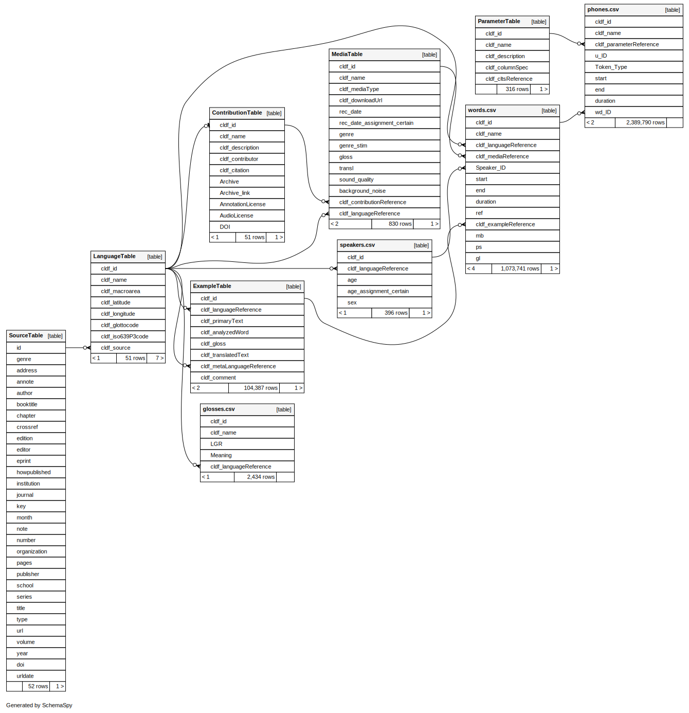
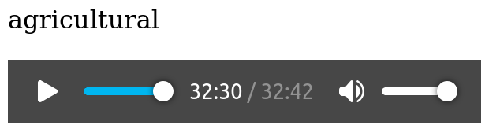

# Using the DoReCo CLDF data

Before you use the DoReCo CLDF data you should read through the data model description at
[cldf/README.md](cldf/README.md).

Due to the size of the DoReCo corpus - more than 2,000,000 annotated phones - analysing the data is
made a lot easier (and quicker) when data is accessed via SQL from the 
[CLDF SQLite](https://github.com/cldf/cldf/blob/master/extensions/sql.md) database.


## Overview

Create the SQLite database by running
```shell
cldf createdb cldf/Generic-metadata.json doreco.sqlite
```

An [entity relationship diagram](https://en.wikipedia.org/wiki/Entity%E2%80%93relationship_model),
visualizing the schena of the resulting database looks as follows:



Notes:
- CLDF's `ParameterTable` stores metadata about sounds, linked from `phones.csv`, if `Token_Type` is
  `xsampa` and an IPA sound corresponding to the X-SAMPA symbol could be determined.
- The database has 4 non-CLDF-standard tables:
  - `glosses.csv`, listing gloss abbreviations used in IGT examples,
  - `speakers.csv`, providing metadata about (core) speakers. Linked from `words.csv`, if available.
  - `words.csv`, listing the time-aligned words in the corpus, 
  - `phones.csv`, listing the time-aligned phones in the corpus.

  These non-CLDF-standard tables are named after the corresponding filename. Thus, to prevent the
  `.` in the name from confusing SQLite, the names must always be escaped in SQL, i.e. wrapped in
  backticks.


## Data access via SQL queries

Data for some interesting objects in the database is most easily accessed using somewhat advanced
SQL constructs like window functions. Consider for example all word-initial phones.

An SQL query to retrieve these could look as follows:

```sql
SELECT s.* FROM (
    SELECT
        p.*,
        row_number() OVER (PARTITION BY wd_ID ORDER BY cldf_id) rownum
    FROM
        `phones.csv` AS p
    ) AS s
WHERE
    s.rownum = 1 AND s.token_type = 'xsampa';
```

Now, since SQLite supports [views](https://en.wikipedia.org/wiki/View_(SQL)), we can hide this complexity
by creating a corresponding view:

```sql
CREATE VIEW word_initials AS
SELECT s.* FROM (
    SELECT
        p.*,
        row_number() OVER (PARTITION BY wd_ID ORDER BY cldf_id) rownum
    FROM
        `phones.csv` AS p
    ) AS s
WHERE
    s.rownum = 1 AND s.token_type = 'xsampa';
```

and then use this view just like the `phones.csv` table:
```sql
SELECT COUNT(*) FROM word_initials;
```

Note that views are regular SQL schema objects, and thus persisted in the database, i.e. will survive
closing the database connection. Views can be deleted by running a `DROP VIEW <name>` query.

Some useful views are defined in [etc/views.sql](etc/views.sql), and can be "installed" in the database
by running
```shell
sqlite3 -echo doreco.sqlite < etc/views.sql
```


## IPA metadata for phones

The default representation for phones in the DoReCo corpus is [X-SAMPA](https://en.wikipedia.org/wiki/X-SAMPA).
But the CLDF dataset adds IPA representations as well as mappings to CLTS sounds.
Thus, information about features of phones can be inferred from the `cldf_cltsReference` column, which
stores IDs from https://raw.githubusercontent.com/cldf-clts/clts/v2.2.0/data/sounds.tsv

```sql
SELECT
  sound_class,
  count(cldf_id) AS word_initial_instances
FROM (
       SELECT
         wi.cldf_id,
         CASE WHEN ipa.cldf_cltsReference LIKE '%_consonant' THEN 'consonant' ELSE 'vowel' END sound_class
       FROM
         word_initials AS wi,
         parametertable AS ipa
       WHERE
         wi.cldf_parameterReference = ipa.cldf_id
     ) AS s
GROUP BY sound_class;
```

Which will output a result similar to

sound class | word_initial_instances
--- | ---
consonant|389871
vowel|99312


## Utterances

Some kinds of analysis make most sense on utterance level, e.g. computing speech rate. To make this
possible, `phones.csv` contains a column `u_id` which allows for aggregating or partitioning phone
data by utterance.

Computing speech rate per utterance as *ln(phones per second)* can be done with the following query:

```sql
SELECT
    p.u_id AS u_id, 
    count(p.cldf_id)/sum(p.duration) AS speech_rate 
FROM
    `phones.csv` AS p
GROUP BY p.u_id;
```

Again, this could be stored as a view (e.g. `utterances` in [etc/views.sql](etc/views.sql)), and joined as
needed for speech-rate sensitive analysis.

With a view `utterance_inititials` (see [etc/views.sql](etc/views.sql)) we could compute average
speech rates per language as follows:

```sql
SELECT
    w.cldf_languagereference,
    AVG(u.speech_rate) AS sr
FROM
    utterance_initials AS ui,
    `words.csv` AS w,
    utterances AS u
WHERE 
    u.u_id = ui.u_id AND ui.wd_id = w.cldf_id 
GROUP BY w.cldf_languagereference 
ORDER BY sr;
```

After storing this query in a file `sr_by_lang.sql` we can run it and pipe the output to a tool such
as [termgraph](https://pypi.org/project/termgraph/) to get a quick overview:

```shell
$ sqlite3 -csv doreco.sqlite < sr_by_lang.sql | termgraph

kama1351: ▇▇▇▇▇▇▇▇▇▇▇▇▇▇▇▇▇▇▇▇▇▇▇▇▇▇▇▇ 8.50 
nngg1234: ▇▇▇▇▇▇▇▇▇▇▇▇▇▇▇▇▇▇▇▇▇▇▇▇▇▇▇▇▇▇▇ 9.43 
lowe1385: ▇▇▇▇▇▇▇▇▇▇▇▇▇▇▇▇▇▇▇▇▇▇▇▇▇▇▇▇▇▇▇ 9.49 
trin1278: ▇▇▇▇▇▇▇▇▇▇▇▇▇▇▇▇▇▇▇▇▇▇▇▇▇▇▇▇▇▇▇▇▇ 10.15
yong1270: ▇▇▇▇▇▇▇▇▇▇▇▇▇▇▇▇▇▇▇▇▇▇▇▇▇▇▇▇▇▇▇▇▇▇ 10.21
resi1247: ▇▇▇▇▇▇▇▇▇▇▇▇▇▇▇▇▇▇▇▇▇▇▇▇▇▇▇▇▇▇▇▇▇▇ 10.45
sadu1234: ▇▇▇▇▇▇▇▇▇▇▇▇▇▇▇▇▇▇▇▇▇▇▇▇▇▇▇▇▇▇▇▇▇▇▇ 10.54
hoch1243: ▇▇▇▇▇▇▇▇▇▇▇▇▇▇▇▇▇▇▇▇▇▇▇▇▇▇▇▇▇▇▇▇▇▇▇▇ 10.77
arap1274: ▇▇▇▇▇▇▇▇▇▇▇▇▇▇▇▇▇▇▇▇▇▇▇▇▇▇▇▇▇▇▇▇▇▇▇▇ 10.92
nort2875: ▇▇▇▇▇▇▇▇▇▇▇▇▇▇▇▇▇▇▇▇▇▇▇▇▇▇▇▇▇▇▇▇▇▇▇▇▇ 11.13
tsim1256: ▇▇▇▇▇▇▇▇▇▇▇▇▇▇▇▇▇▇▇▇▇▇▇▇▇▇▇▇▇▇▇▇▇▇▇▇▇▇ 11.40
even1259: ▇▇▇▇▇▇▇▇▇▇▇▇▇▇▇▇▇▇▇▇▇▇▇▇▇▇▇▇▇▇▇▇▇▇▇▇▇▇ 11.56
sanz1248: ▇▇▇▇▇▇▇▇▇▇▇▇▇▇▇▇▇▇▇▇▇▇▇▇▇▇▇▇▇▇▇▇▇▇▇▇▇▇ 11.57
ligh1234: ▇▇▇▇▇▇▇▇▇▇▇▇▇▇▇▇▇▇▇▇▇▇▇▇▇▇▇▇▇▇▇▇▇▇▇▇▇▇ 11.57
orko1234: ▇▇▇▇▇▇▇▇▇▇▇▇▇▇▇▇▇▇▇▇▇▇▇▇▇▇▇▇▇▇▇▇▇▇▇▇▇▇ 11.59
beja1238: ▇▇▇▇▇▇▇▇▇▇▇▇▇▇▇▇▇▇▇▇▇▇▇▇▇▇▇▇▇▇▇▇▇▇▇▇▇▇ 11.59
jeha1242: ▇▇▇▇▇▇▇▇▇▇▇▇▇▇▇▇▇▇▇▇▇▇▇▇▇▇▇▇▇▇▇▇▇▇▇▇▇▇ 11.62
yura1255: ▇▇▇▇▇▇▇▇▇▇▇▇▇▇▇▇▇▇▇▇▇▇▇▇▇▇▇▇▇▇▇▇▇▇▇▇▇▇▇ 11.69
bora1263: ▇▇▇▇▇▇▇▇▇▇▇▇▇▇▇▇▇▇▇▇▇▇▇▇▇▇▇▇▇▇▇▇▇▇▇▇▇▇▇ 11.72
sout3282: ▇▇▇▇▇▇▇▇▇▇▇▇▇▇▇▇▇▇▇▇▇▇▇▇▇▇▇▇▇▇▇▇▇▇▇▇▇▇▇ 11.76
yuca1254: ▇▇▇▇▇▇▇▇▇▇▇▇▇▇▇▇▇▇▇▇▇▇▇▇▇▇▇▇▇▇▇▇▇▇▇▇▇▇▇ 11.81
svan1243: ▇▇▇▇▇▇▇▇▇▇▇▇▇▇▇▇▇▇▇▇▇▇▇▇▇▇▇▇▇▇▇▇▇▇▇▇▇▇▇ 11.86
dolg1241: ▇▇▇▇▇▇▇▇▇▇▇▇▇▇▇▇▇▇▇▇▇▇▇▇▇▇▇▇▇▇▇▇▇▇▇▇▇▇▇ 11.89
goem1240: ▇▇▇▇▇▇▇▇▇▇▇▇▇▇▇▇▇▇▇▇▇▇▇▇▇▇▇▇▇▇▇▇▇▇▇▇▇▇▇▇ 11.97
movi1243: ▇▇▇▇▇▇▇▇▇▇▇▇▇▇▇▇▇▇▇▇▇▇▇▇▇▇▇▇▇▇▇▇▇▇▇▇▇▇▇▇ 12.03
urum1249: ▇▇▇▇▇▇▇▇▇▇▇▇▇▇▇▇▇▇▇▇▇▇▇▇▇▇▇▇▇▇▇▇▇▇▇▇▇▇▇▇ 12.05
cash1254: ▇▇▇▇▇▇▇▇▇▇▇▇▇▇▇▇▇▇▇▇▇▇▇▇▇▇▇▇▇▇▇▇▇▇▇▇▇▇▇▇ 12.05
anal1239: ▇▇▇▇▇▇▇▇▇▇▇▇▇▇▇▇▇▇▇▇▇▇▇▇▇▇▇▇▇▇▇▇▇▇▇▇▇▇▇▇ 12.18
kaka1265: ▇▇▇▇▇▇▇▇▇▇▇▇▇▇▇▇▇▇▇▇▇▇▇▇▇▇▇▇▇▇▇▇▇▇▇▇▇▇▇▇ 12.20
cabe1245: ▇▇▇▇▇▇▇▇▇▇▇▇▇▇▇▇▇▇▇▇▇▇▇▇▇▇▇▇▇▇▇▇▇▇▇▇▇▇▇▇ 12.23
warl1254: ▇▇▇▇▇▇▇▇▇▇▇▇▇▇▇▇▇▇▇▇▇▇▇▇▇▇▇▇▇▇▇▇▇▇▇▇▇▇▇▇▇ 12.25
stan1290: ▇▇▇▇▇▇▇▇▇▇▇▇▇▇▇▇▇▇▇▇▇▇▇▇▇▇▇▇▇▇▇▇▇▇▇▇▇▇▇▇▇ 12.30
teop1238: ▇▇▇▇▇▇▇▇▇▇▇▇▇▇▇▇▇▇▇▇▇▇▇▇▇▇▇▇▇▇▇▇▇▇▇▇▇▇▇▇▇ 12.35
taba1259: ▇▇▇▇▇▇▇▇▇▇▇▇▇▇▇▇▇▇▇▇▇▇▇▇▇▇▇▇▇▇▇▇▇▇▇▇▇▇▇▇▇ 12.41
kark1256: ▇▇▇▇▇▇▇▇▇▇▇▇▇▇▇▇▇▇▇▇▇▇▇▇▇▇▇▇▇▇▇▇▇▇▇▇▇▇▇▇▇ 12.49
pnar1238: ▇▇▇▇▇▇▇▇▇▇▇▇▇▇▇▇▇▇▇▇▇▇▇▇▇▇▇▇▇▇▇▇▇▇▇▇▇▇▇▇▇ 12.54
ngal1292: ▇▇▇▇▇▇▇▇▇▇▇▇▇▇▇▇▇▇▇▇▇▇▇▇▇▇▇▇▇▇▇▇▇▇▇▇▇▇▇▇▇▇ 12.78
sout2856: ▇▇▇▇▇▇▇▇▇▇▇▇▇▇▇▇▇▇▇▇▇▇▇▇▇▇▇▇▇▇▇▇▇▇▇▇▇▇▇▇▇▇ 12.84
ruul1235: ▇▇▇▇▇▇▇▇▇▇▇▇▇▇▇▇▇▇▇▇▇▇▇▇▇▇▇▇▇▇▇▇▇▇▇▇▇▇▇▇▇▇▇ 12.99
komn1238: ▇▇▇▇▇▇▇▇▇▇▇▇▇▇▇▇▇▇▇▇▇▇▇▇▇▇▇▇▇▇▇▇▇▇▇▇▇▇▇▇▇▇▇ 13.03
jeju1234: ▇▇▇▇▇▇▇▇▇▇▇▇▇▇▇▇▇▇▇▇▇▇▇▇▇▇▇▇▇▇▇▇▇▇▇▇▇▇▇▇▇▇▇ 13.08
savo1255: ▇▇▇▇▇▇▇▇▇▇▇▇▇▇▇▇▇▇▇▇▇▇▇▇▇▇▇▇▇▇▇▇▇▇▇▇▇▇▇▇▇▇▇ 13.12
port1286: ▇▇▇▇▇▇▇▇▇▇▇▇▇▇▇▇▇▇▇▇▇▇▇▇▇▇▇▇▇▇▇▇▇▇▇▇▇▇▇▇▇▇▇▇ 13.30
sumi1235: ▇▇▇▇▇▇▇▇▇▇▇▇▇▇▇▇▇▇▇▇▇▇▇▇▇▇▇▇▇▇▇▇▇▇▇▇▇▇▇▇▇▇▇▇ 13.43
apah1238: ▇▇▇▇▇▇▇▇▇▇▇▇▇▇▇▇▇▇▇▇▇▇▇▇▇▇▇▇▇▇▇▇▇▇▇▇▇▇▇▇▇▇▇▇▇▇ 13.81
goro1270: ▇▇▇▇▇▇▇▇▇▇▇▇▇▇▇▇▇▇▇▇▇▇▇▇▇▇▇▇▇▇▇▇▇▇▇▇▇▇▇▇▇▇▇▇▇▇▇ 14.08
nort2641: ▇▇▇▇▇▇▇▇▇▇▇▇▇▇▇▇▇▇▇▇▇▇▇▇▇▇▇▇▇▇▇▇▇▇▇▇▇▇▇▇▇▇▇▇▇▇▇ 14.11
bain1259: ▇▇▇▇▇▇▇▇▇▇▇▇▇▇▇▇▇▇▇▇▇▇▇▇▇▇▇▇▇▇▇▇▇▇▇▇▇▇▇▇▇▇▇▇▇▇▇ 14.27
texi1237: ▇▇▇▇▇▇▇▇▇▇▇▇▇▇▇▇▇▇▇▇▇▇▇▇▇▇▇▇▇▇▇▇▇▇▇▇▇▇▇▇▇▇▇▇▇▇▇▇ 14.41
vera1241: ▇▇▇▇▇▇▇▇▇▇▇▇▇▇▇▇▇▇▇▇▇▇▇▇▇▇▇▇▇▇▇▇▇▇▇▇▇▇▇▇▇▇▇▇▇▇▇▇▇ 14.85
nisv1234: ▇▇▇▇▇▇▇▇▇▇▇▇▇▇▇▇▇▇▇▇▇▇▇▇▇▇▇▇▇▇▇▇▇▇▇▇▇▇▇▇▇▇▇▇▇▇▇▇▇▇ 14.94
```


## Speaker information

Speaker information is available from the `speakers.csv` table, which can be joined to phones via
`words.csv`. E.g. the following query counts phones per speaker sex.

```sql
sqlite> 
    SELECT
        s.sex, count(p.cldf_id) 
    FROM
        `phones.csv` as p, 
        `words.csv` as w, 
        `speakers.csv` as s
    WHERE
        p.wd_id = w.cldf_id AND w.speaker_id = s.cldf_id
    GROUP BY s.sex;
f|948453
m|1238361
```

Correlations between speaker metadata and IPA phone metadata can be assessed by joining
the ParameterTable as well:

```sql
sqlite> 
    SELECT
        s.sex, ipa.cldf_name, count(p.cldf_id)
    from 
        `phones.csv` as p, 
        `words.csv` as w, 
        `speakers.csv` as s, 
        parametertable as ipa 
    where 
        p.wd_id = w.cldf_id and 
        w.speaker_id = s.cldf_id and 
        p.cldf_parameterReference = ipa.cldf_id and 
        ipa.cldf_cltsreference like '%breathy%' 
    group by p.cldf_name, s.sex;
f|lʱ|31
m|lʱ|4
f|nʱ|16
m|nʱ|7
```


## Audio files

The DoReCo CLDF dataset also includes information about the publicly available audio files underlying the
corpora. The `start` and `end` columns in `words.csv` and `phones.csv` provide time stamps relative
to the linked files.

Thus, the following query retrieves the longest word in the sout3282 corpus, and its position in the
audio file:

```sql
sqlite> 
    SELECT 
        w.cldf_id, w.cldf_name, count(p.cldf_id) AS wl, f.cldf_downloadUrl, w.start, w.end 
    FROM 
        `phones.csv` AS p, 
        `words.csv` AS w, 
        mediatable AS f 
    WHERE
        p.wd_id = w.cldf_id AND
        w.cldf_languageReference = 'sout3282' AND
        w.cldf_mediaReference = f.cldf_id 
    GROUP BY w.cldf_id 
    ORDER BY wl DESC 
    LIMIT 1;
sout3282_w020797|agricultural|12|https://api.nakala.fr/data/10.34847%2Fnkl.dcfbh2yw/830afcf32230aa859b39a92137edbdb18c5b174f|1950.493|1951.383
```

Plugging this data into HTML as follows
```html
<html>
<body>
<p>agricultural</p>
<audio preload="auto"
       controls="controls" 
       src="https://api.nakala.fr/data/10.34847%2Fnkl.dcfbh2yw/830afcf32230aa859b39a92137edbdb18c5b174f#t=1950.493,1951.383">
</audio>
</body>
</html>
```
and saving the file as `agricultural.html` you can get a light-weight corpus viewer by opening the file
in your browser and clicking the play button to listen to the word.

> 
